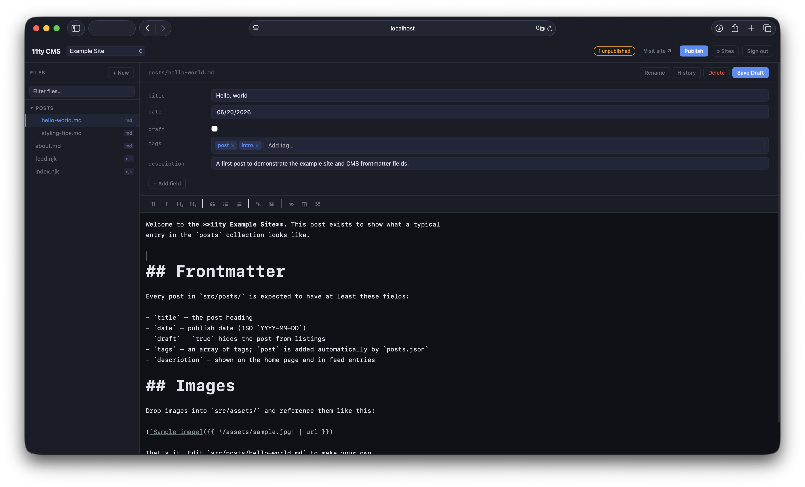

# 11ty CMS

[](https://github.com/Raylu42x/11ty-cms/actions/workflows/ci.yml)
[](./LICENSE)
[](./.nvmrc)

A self-hosted, Dockerized content management system for sites built with [Eleventy (11ty)](https://www.11ty.dev/) and hosted on GitHub Pages.



The CMS runs on your own VPS. It clones your site repos locally, lets you edit content through a clean web UI, then pushes changes back to GitHub — where a GitHub Actions workflow builds the 11ty site and deploys to GitHub Pages via `/docs`.

> **Don't have an 11ty site yet?** Fork the [11ty-example-site](https://github.com/Raylu42x/11ty-example-site) starter and add it to the CMS to try everything end-to-end in a few minutes.

---

## Features

- **Multi-site** — manage as many 11ty sites as you want from one dashboard
- **File browser** — sidebar tree with folder collapsing and live search/filter
- **Markdown editor** — EasyMDE with live preview, side-by-side mode, and word count
- **Frontmatter editor** — auto-detected field types (text, boolean, date, number, tags) with add/remove
- **Frontmatter defaults** — define default fields per site and per folder; auto-populate on open/create
- **Media library** — upload, preview, and insert images; auto-optimized on upload
- **File management** — rename and delete files without touching the command line
- **Git history** — see the last 15 commits for any open file
- **Publish** — commit and push to GitHub with one click; GitHub Actions builds and deploys
- **Draft saves** — save locally without pushing (Cmd+S / Ctrl+S)
- **GitHub Actions setup** — automatically writes a build workflow to repos on first clone
- **Cloudflare Tunnel ready** — no open ports required on your VPS
- **Docker** — single `docker compose up -d` to deploy

---

## Requirements

- **Node.js 20+** (for local dev)
- **Docker + Docker Compose** (for VPS deployment)
- **Git** installed on the host
- A **GitHub account** with a personal access token (`repo` and `workflow` scopes)
- One or more **11ty site repos** on GitHub
- (Optional) A **Cloudflare account** for tunnel-based HTTPS

---

## Quick Start — Prebuilt Docker Image

A prebuilt multi-arch image (`linux/amd64`, `linux/arm64`) is published to GHCR on every release:

```bash
mkdir -p repos config
cp .env.example .env
# Edit .env — set SESSION_SECRET and GITHUB_TOKEN

docker run -d --name 11ty-cms \
  -p 3000:3000 \
  --env-file .env \
  -v "$PWD/repos:/repos" \
  -v "$PWD/config:/app/config" \
  --restart unless-stopped \
  ghcr.io/raylu42x/11ty-cms:latest
```

---

## Quick Start — Local Dev

```bash
git clone https://github.com/YOUR_USERNAME/11ty-cms.git
cd 11ty-cms
npm install

cp .env.example .env
# Edit .env — at minimum set SESSION_SECRET and GITHUB_TOKEN

npm run dev
# Open http://localhost:3000 — you'll be sent to /setup to create your admin password
```

On first visit, the CMS routes you to a one-time setup page to create the admin password. The hash is written to `config/admin.json` (gitignored). No CLI hash generation required.

---

## Environment Variables

| Variable               | Required | Description                                                                                       |
| ---------------------- | -------- | ------------------------------------------------------------------------------------------------- |
| `PORT`                 | No       | Port to listen on (default: `3000`)                                                               |
| `HOST`                 | No       | Interface to bind to (default: `127.0.0.1`). Set to `0.0.0.0` to expose to the network or Docker. |
| `SESSION_SECRET`       | Yes      | Long random string — `openssl rand -hex 32`                                                       |
| `ADMIN_PASSWORD_HASH`  | No       | Skip the setup wizard by providing a bcrypt hash here. Otherwise use `/setup` on first visit.     |
| `GITHUB_TOKEN`         | Yes      | GitHub PAT with `repo` and `workflow` scopes, used to push to your site repos                     |
| `GIT_USER_NAME`        | No       | Name on CMS commits (default: `CMS Bot`)                                                          |
| `GIT_USER_EMAIL`       | No       | Email on CMS commits                                                                              |
| `REPOS_DIR`            | No       | Where site repos are cloned. Defaults to `./repos/`. Docker sets this to `/repos`.                |
| `UPDATE_CHECK_ENABLED` | No       | Set to `true` to enable a daily check for a newer release and show a banner.                      |

---

## VPS Deployment

### 1. Install Docker

```bash
curl -fsSL https://get.docker.com | sh
```

### 2. Clone and configure

```bash
git clone https://github.com/YOUR_USERNAME/11ty-cms.git /opt/11ty-cms
cd /opt/11ty-cms
cp .env.example .env
nano .env
```

### 3. Start

```bash
docker compose up -d
docker compose logs -f   # watch for errors
```

The `repos/` and `config/` directories are bind-mounted, so your site data and config survive container restarts and upgrades.

---

## Cloudflare Tunnel (recommended — no open ports needed)

```bash
# Install cloudflared
curl -L https://github.com/cloudflare/cloudflared/releases/latest/download/cloudflared-linux-amd64 \
  -o /usr/local/bin/cloudflared && chmod +x /usr/local/bin/cloudflared

cloudflared tunnel login
cloudflared tunnel create my-cms
# Note the UUID printed — you'll need it below
```

Create `/etc/cloudflared/config.yml`:

```yaml
tunnel: <YOUR-TUNNEL-UUID>
credentials-file: /root/.cloudflared/<YOUR-TUNNEL-UUID>.json

ingress:
  - hostname: cms.yourdomain.com
    service: http://localhost:3000
  - service: http_status:404
```

```bash
cloudflared service install
systemctl enable cloudflared
systemctl start cloudflared
```

In your **Cloudflare DNS** dashboard, add:

- **Type:** CNAME
- **Name:** `cms`
- **Target:** `<YOUR-TUNNEL-UUID>.cfargotunnel.com`
- **Proxy status:** Proxied (orange cloud)

Your CMS will be reachable at `https://cms.yourdomain.com` with no firewall rules or open ports.

---

## Setting Up a Site Repo

Before adding a site to the CMS, your GitHub repo needs GitHub Pages enabled to serve from the `/docs` folder:

1. Go to your repo on GitHub → **Settings → Pages**
2. **Source:** Deploy from a branch
3. **Branch:** `main` — **Folder:** `/docs`
4. Save

The CMS will write a GitHub Actions workflow (`.github/workflows/build.yml`) on first clone that runs `npx @11ty/eleventy --output=docs` and commits the result. You don't need to set this up manually.

---

## Adding a Site in the CMS

1. Click **⚙ Sites** in the header
2. Fill in the **Add a site** form:
   - **Display name** — anything you want to call it
   - **GitHub repo URL** — HTTPS clone URL (e.g. `https://github.com/you/my-site.git`)
   - **Content directory** — folder with your markdown files (e.g. `src`)
   - **Media directory** — folder for uploaded images (e.g. `src/images`)
   - **Branch** — usually `main`
   - **Live site URL** — optional; enables the **Visit site ↗** button in the header
3. Click **Add & Clone**

The repo will be cloned and the GitHub Actions workflow written. Hit **Publish** once to push the workflow file to GitHub.

---

## GitHub Actions Workflow

The auto-generated workflow (also available in `site-template/`):

- Triggers on pushes to `main` that touch `src/**` or Eleventy config files
- Runs `npm ci` and `npx @11ty/eleventy --output=docs`
- Commits the `/docs` output back with `[skip ci]` to avoid loops
- GitHub Pages serves the `/docs` folder

You can customise it after the first publish by editing `.github/workflows/build.yml` directly in your site repo.

---

## Frontmatter Defaults

Open **⚙ Sites → Defaults** next to any site to define fields that auto-populate when opening or creating files:

- **Site-wide** — applies to every file
- **Per folder** — e.g. `posts/` or `projects/` override site-wide defaults

Field values support strings, numbers, booleans (`true`/`false`), and arrays (`["tag1","tag2"]`). Existing values in files are never overwritten.

---

## GitHub Token Permissions

Create a token at **GitHub → Settings → Developer settings → Personal access tokens → Tokens (classic)**. Required scopes:

- `repo` — full control of repositories (needed to push commits).
- `workflow` — needed because the CMS creates and updates `.github/workflows/build.yml` in your site repos. Without this scope, the first publish will fail with `refusing to allow a Personal Access Token to create or update workflow without 'workflow' scope`.

The token is stored only in your `.env` file on your VPS and injected into git remote URLs at push time. It is never logged or exposed to the browser.

---

## What 11ty CMS isn't

To save everyone time:

- **Not multi-user.** One admin per instance. No roles, teams, or per-user audit trail.
- **Not a Decap / Tina / Netlify CMS replacement** if you publish to Netlify, Vercel, or similar hosted SSGs. It assumes GitHub Pages with a `/docs` build step.
- **Not a WYSIWYG site builder.** You're editing markdown and frontmatter; templates and styles live in your 11ty repo.
- **Not a database-backed CMS.** Git is the database. Every change is a commit.
- **Not designed for non-11ty static sites.** Other SSGs may work if their structure is similar, but only 11ty is tested.

---

## Backup and Restore

The CMS is stateless. Everything important lives elsewhere:

- **Your content** is in the GitHub repos for each site. Nothing to back up — GitHub is your backup.
- **Your CMS config** is in `config/sites.json` (which sites exist, frontmatter defaults) and `config/admin.json` (admin password hash). Both are in the bind-mounted `config/` directory.
- **Cloned repos** in `repos/` are throw-away — the CMS re-clones from GitHub on demand.

To migrate to a new VPS: copy `config/sites.json` and `config/admin.json`, copy your `.env`, run `docker compose up -d`. The CMS will re-clone repos from GitHub on first use of each site.

---

## FAQ

**Can I use this with a non-11ty static site generator?**
Probably not without code changes. The publish flow assumes 11ty's `src/` → `docs/` convention and writes an Eleventy-specific GitHub Actions workflow. If you're on Hugo / Astro / Jekyll, it's a fork-and-modify situation.

**How do I add custom CSS or layouts to the editor preview?**
You can't — the preview is EasyMDE's default markdown rendering, not your site's actual templates. To see how your site looks, click **Visit site ↗** after publishing. (A future version may render previews through your real 11ty config.)

**Can I run this without Docker?**
Yes — `npm install && npm start`. Bind it behind a reverse proxy (Caddy, nginx, Cloudflare Tunnel) and don't expose port 3000 directly to the internet.

**My token has `repo` scope but publish still fails with `workflow` scope error.**
GitHub treats `workflow` as a separate scope on top of `repo`. Regenerate the token with both checked. The CMS auto-creates `.github/workflows/build.yml` in your site repos, which requires `workflow`.

**Where's the password I just set?**
Bcrypt hash in `config/admin.json`. To reset: stop the container, delete `config/admin.json`, restart, visit `/setup` again.

**Is it safe to expose this to the public internet?**
With `HOST=0.0.0.0`, basic auth, rate-limited login, and a strong password — yes, but a reverse proxy with TLS (Cloudflare Tunnel or Caddy) is strongly recommended. The CMS does not provide TLS itself.

---

## License

MIT — see [LICENSE](LICENSE).
